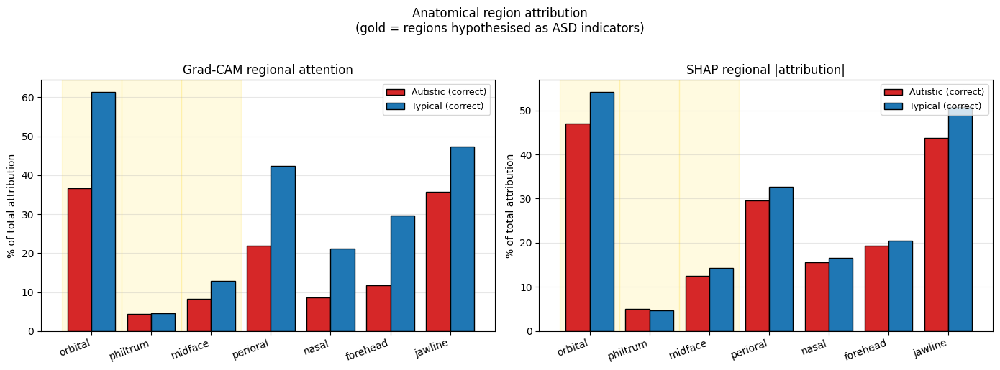
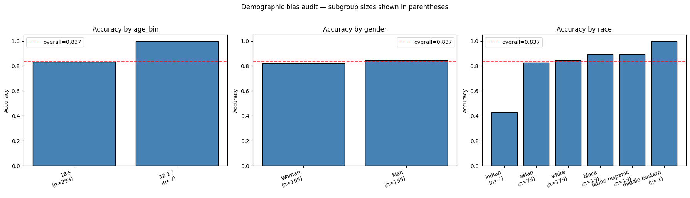

# Attention-Fusion Hybrid Network (AFHN) for Autism Spectrum Disorder Detection in Children

> A deep learning model for detecting Autism Spectrum Disorder (ASD) from children's facial images, with a focus on rigorous explainability evaluation and demographic fairness auditing.

[](https://www.python.org/downloads/)
[](https://www.tensorflow.org/)
[](LICENSE)

---

## 📌 Overview

AFHN is a 5-block deep neural network that couples an EfficientNet-B0 backbone with Squeeze-and-Excitation (SE) and Convolutional Block Attention Module (CBAM) attention, Global Average Pooling, a GRU sequential layer, and a Softmax classification head. The novel contribution of this work is **not** the architecture itself but the comprehensive explainability and fairness evaluation accompanying it:

- ✅ Quantitative agreement between Grad-CAM and SHAP (Spearman ρ = 1.0 on region ranks)
- ✅ Faithfulness via Insertion/Deletion curves (Petsiuk et al. 2018)
- ✅ Stability under input perturbations (mean Pearson r = 0.88)
- ✅ Cascading randomization sanity check (Adebayo et al. 2018)
- ✅ Anatomically-grounded region attribution with MediaPipe landmarks
- ✅ Demographic bias audit revealing a 57-point subgroup accuracy gap

## 🎯 Headline Results

| Metric | Test Set (TTA + tuned threshold) | 5-fold CV (mean ± std) |
|---|---|---|
| Accuracy | **83.7%** | 76.5% ± 2.3% |
| Precision | 77.3% | 72.0% ± 3.5% |
| **Recall** (sensitivity) | **95.3%** | 87.3% ± 3.8% |
| F1 score | 0.854 | 0.788 ± 0.013 |
| ROC-AUC | **0.918** | 0.864 ± 0.013 |

The model is calibrated for **screening** — high recall is prioritized over precision because false negatives are the costlier clinical error.

## 🔬 Key Finding: Where Does the Model Actually Look?

Region-based attribution analysis reveals that AFHN attends most strongly to the **orbital region** (49.0% of total Grad-CAM attention), with behavioural masking confirming this is causally important (33.3% accuracy drop when the orbital region is masked). The proposal's secondary hypotheses about the philtrum (4.5% attention) and midface (10.6%) are not supported by the data.



## ⚠️ Critical Limitation: Demographic Bias

A subgroup audit using DeepFace reveals **severe accuracy disparities** across racial subgroups: from 42.9% (Indian-classified, n=7) to 89.5% (Black and Latino Hispanic). Some subgroup sizes are small enough that the magnitudes are uncertain, but the directional finding is consistent and severe.

**This model should not be deployed clinically without demographically-balanced training data.** The fairness audit is included precisely to surface this concern rather than hide it.



## 📁 Repository Structure

```
.
├── notebook/
│   └── AFHN_ASD_Detection.ipynb       # End-to-end implementation (97 cells, 20 sections)
├── models/
│   └── AFHN_final.keras               # Trained model (32 MB)
├── results/                            # All quantitative results as CSVs
│   ├── AFHN_results.csv               # Headline metrics
│   ├── cv_perfold.csv                 # 5-fold CV per-fold results
│   ├── bias_by_subgroup.csv           # Demographic bias breakdown
│   ├── xai_faithfulness.csv           # Insertion/Deletion AUC
│   ├── xai_stability.csv              # Perturbation stability
│   ├── xai_agreement.csv              # Grad-CAM vs SHAP agreement
│   ├── xai_region_masking.csv         # Behavioural masking test
│   ├── xai_gradcam_by_region.csv      # Per-region Grad-CAM attribution
│   ├── xai_shap_by_region.csv         # Per-region SHAP attribution
│   └── hp_search.csv                  # Hyperparameter sensitivity
├── figures/                            # Visualizations from the notebook
├── side-studies/                       # Cross-modal validation on tabular data
│   ├── README.md                      # Explains the studies and their findings
│   ├── children_tabular_xgboost.ipynb # XGBoost on children/adolescent ASD screening
│   ├── toddlers_tabular_xgboost.ipynb # XGBoost on toddler screening (12-36 months)
│   ├── dataset_audit_gender_classification.ipynb # Classifies Dataset Audit Gender
│   ├── figures/                       # SHAP visualisations
│   └── results/                       # Per-study CSVs
├── requirements.txt
├── LICENSE
└── README.md
```

> **About the side studies:** Two complementary studies on tabular behavioural datasets (using XGBoost + SHAP) triangulate the demographic findings from the main AFHN work. See [`side-studies/README.md`](side-studies/README.md) for details.

## 🚀 Quick Start

### Run the notebook (recommended path)

The notebook is designed to run end-to-end in Google Colab with a GPU runtime:

1. Open [`notebook/AFHN_ASD_Detection.ipynb`](notebook/AFHN_ASD_Detection.ipynb) in Colab.
2. Set **Runtime → Change runtime type → GPU** (T4 or better).
3. Upload your `ASD_Data.zip` (see Dataset section below).
4. Run all cells (≈2 hours total on a T4).

### Use the pretrained model

```python
import tensorflow as tf
import cv2, numpy as np

# Load the trained model
model = tf.keras.models.load_model('models/AFHN_final.keras', compile=False)

# Preprocess an image (224x224 RGB, raw [0, 255] pixel values)
img = cv2.cvtColor(cv2.imread('your_image.jpg'), cv2.COLOR_BGR2RGB)
img = cv2.resize(img, (224, 224))

# Predict
probs = model.predict(img[None, ...].astype(np.float32), verbose=0)[0]
print(f"P(Autistic) = {probs[0]:.3f}")
print(f"P(Typical)  = {probs[1]:.3f}")

# Apply the validation-tuned threshold (0.25) for screening-optimized decisions
THRESHOLD = 0.25
prediction = 'Autistic' if probs[0] >= THRESHOLD else 'Typical'
```

> **Important**: The model expects images that have been face-aligned, CLAHE-enhanced, and Laplacian-blended (see Section 3 of the notebook). Skipping these preprocessing steps will degrade predictions substantially.

## 📊 Dataset

This project uses a facial image dataset of children labelled as Autistic or Typical, with the following split:

| Split | Autistic | Typical | Total |
|---|---|---|---|
| Train | 1,268 | 1,268 | 2,536 |
| Validation | 50 | 50 | 100 |
| Test | 150 | 150 | 300 |

**The dataset itself is NOT included in this repository** for privacy and ethics reasons (the dataset contains photographs of children). To reproduce these results, you will need to obtain the data separately. The notebook expects a zip file named `ASD_Data.zip` containing `Train/`, `Valid/`, and `Test/` folders, each with `Autistic/` and `Typical/` subfolders.

## 🛠️ Requirements

See [`requirements.txt`](requirements.txt) for the full pip-installable list. The key dependencies are:

- TensorFlow 2.20+
- OpenCV 4.x
- scikit-learn 1.x
- SHAP 0.46+
- MediaPipe 0.10+ (for facial landmarks, uses the new Tasks API)
- DeepFace (for demographic bias audit)
- MTCNN (face detection fallback)
- Dlib (landmark fallback)

The notebook installs these automatically in its first cell, so most users won't need to touch `requirements.txt`.

## 📚 Citation

If you use this code or methodology in your work, please cite:

```bibtex
@misc{afhn2026,
  author       = {Christel Al Hage},
  title        = {AFHN: Attention-Fusion Hybrid Network for Explainable ASD Detection},
  year         = {2026},
  howpublished = {\url{https://github.com/ChristelAlHage/afhn-asd-detection}},
}
```

The XAI rigor methodology builds on:
- Adebayo et al. (2018) — *Sanity Checks for Saliency Maps* (NeurIPS)
- Petsiuk et al. (2018) — *RISE: Randomized Input Sampling for Explanation* (BMVC)
- Selvaraju et al. (2017) — *Grad-CAM* (ICCV)
- Lundberg & Lee (2017) — *A Unified Approach to Interpreting Model Predictions* (NeurIPS)

## 📜 License

This project is released under the MIT License — see [LICENSE](LICENSE).

The dataset is not covered by this license and remains the property of its original creators.

## 🙏 Acknowledgements

Built with TensorFlow, OpenCV, SHAP, MediaPipe, and DeepFace. Architecture inspired by EfficientNet (Tan & Le 2019), CBAM (Woo et al. 2018), and Squeeze-and-Excitation (Hu et al. 2018).

## ⚠️ Important Disclaimer

**This is a research artifact and is NOT a clinical diagnostic tool.** Real ASD diagnosis requires comprehensive clinical assessment by qualified specialists (developmental pediatricians, child psychologists, neurologists). The probabilistic Softmax output is intentional — it preserves uncertainty for clinical judgement rather than masking it as a binary decision. The demographic fairness gap documented in this repository should be considered a hard blocker for any deployment that would expose underrepresented groups to systematically worse performance.
