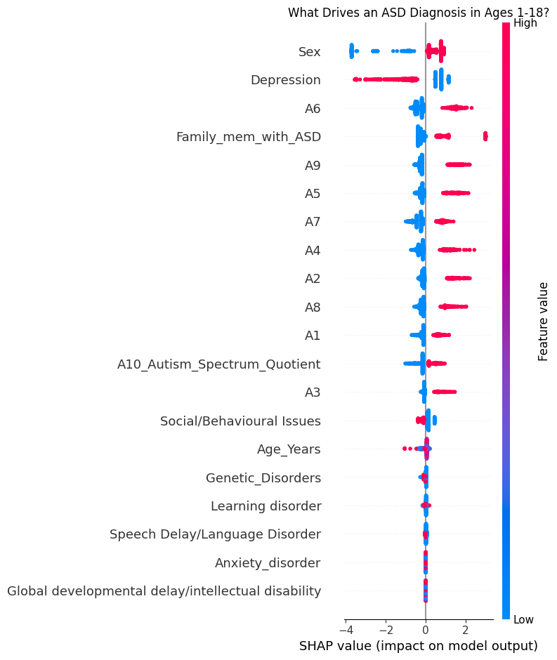
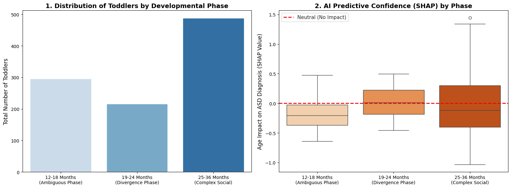

# Cross-Modal Validation Studies

> Three complementary side studies that triangulate the demographic findings from the main AFHN facial-image work. Two use tabular behavioural datasets with a different model class (XGBoost); a third audits the AFHN dataset itself for compositional bias.

## Why these are here

The main AFHN work (in [`../notebook/`](../notebook/)) audits demographic bias on a facial-image dataset and finds substantial subgroup performance gaps. A natural question is whether these patterns reflect a genuine clinical signal (age and gender really matter for ASD detection) or are artifacts of the specific image dataset.

To triangulate this, we ran three side studies:

- **Studies 1 & 2** use **tabular behavioural/clinical datasets** with **XGBoost + SHAP**. The reasoning: if subgroup patterns are consistent across image-based deep learning *and* tabular gradient boosting on completely different datasets, the patterns are more likely to reflect real clinical structure than dataset artifacts.
- **Study 3** is a **per-image audit of the AFHN training dataset itself**, using YOLOv8-Face for cropping and a Hugging Face gender classifier to characterize the apparent-gender distribution per class. This addresses the question: are the bias findings about the *model* or about the *data*?

These studies are **exploratory triangulation**, not primary evidence. They are documented thoroughly so anyone reproducing the main work can see the broader picture.

---

## Study 1: Children & Adolescents (ages 1–18)

**Notebook:** [`children_tabular_xgboost.ipynb`](children_tabular_xgboost.ipynb)
**Dataset:** [Kaggle: ASD Screening for Children and Adolescents](https://www.kaggle.com/datasets/uppulurimadhuri/dataset) (~2,000 records)
**Features:** 10 behavioural questionnaire items (A1–A10), demographics, clinical comorbidities (depression, anxiety, genetic disorders, speech delay, intellectual disability)

### Key results

| Metric | Value |
|---|---|
| Overall accuracy | **87.9%** |
| Girls (pooled model) | **99.1%** |
| Boys (pooled model) | **83.7%** |
| Girls-only model | 97.2% |
| Boys-only model | 84.8% |

### What SHAP revealed

Gender was the **top-ranked feature** in SHAP, ahead of all 10 behavioural questionnaire items. Depression and family history of ASD were also strong predictors.

### Connection to AFHN

The Children dataset shows girls are *easier* to classify, while AFHN's facial-image work shows a modest male-favoured gap. The directional inconsistency is itself informative — suggesting the AFHN gap may be driven by facial-feature distribution rather than the questionnaire-detectable behavioural-presentation differences known to make ASD harder to detect in girls clinically.

---

## Study 2: Toddlers (ages 12–36 months)

**Notebook:** [`toddlers_tabular_xgboost.ipynb`](toddlers_tabular_xgboost.ipynb)
**Dataset:** [Kaggle: Early Autism Screening Dataset for Toddlers](https://www.kaggle.com/datasets/ajithdari/early-autism-screening-dataset-for-toddlers) (~1,000 records)
**Features:** Behavioural scores (social interaction, communication, repetitive behaviour, language delay), demographics, jaundice history, family ASD history

### Key results

| Metric | Value |
|---|---|
| Overall accuracy | **46%** (below chance for binary classification) |

### Why the low accuracy is actually the finding

Without SHAP analysis, 46% accuracy looks like a failure. With SHAP, it becomes a clinically-meaningful result: the model's confidence stratifies by developmental phase in a way that mirrors documented paediatric milestones.

- **12–18 months (Ambiguous Phase):** SHAP impact is *negative* (median ~−0.2). The model recognises this as a phase where neurotypical and autistic toddlers exhibit largely overlapping behaviours, and (correctly) refuses to commit to confident predictions.
- **19–24 months (Divergence Phase):** SHAP impact is near zero. Diagnostic signals are beginning to emerge but are not yet stable.
- **25–36 months (Complex Social Phase):** SHAP impact spreads widely (−1.0 to +1.5). The model becomes confident, and is correct more often than not.

**The interpretation:** the model's low aggregate accuracy is not a modeling failure but a *faithful reflection of a clinical reality* — early ASD screening before ~24 months is genuinely difficult because the diagnostic signal has not yet emerged.

### Connection to AFHN

Both AFHN's age-bin analysis and the Toddler study show predictability concentrating in older subjects. The Toddler study's SHAP-grounded interpretation provides a candidate mechanism: ASD-relevant signatures simply have not yet diverged enough from neurotypical baselines in very young children. For AFHN, this implies the model is likely most reliable for older children — and any deployment should explicitly age-stratify reported accuracies rather than report a single aggregate number.

---

## Study 3: Gender Audit of the AFHN Dataset

**Notebook:** [`dataset_audit_gender_classification.ipynb`](dataset_audit_gender_classification.ipynb)
**Dataset:** Same dataset used for the main AFHN work
**Pipeline:** YOLOv8-Face for face cropping → Hugging Face `rizvandwiki/gender-classification` for apparent-gender prediction

### What it does

For every image in Train/Valid/Test, this notebook (i) detects and crops the face with YOLOv8, (ii) feeds the crop to a pretrained gender classifier, and (iii) tallies apparent-gender counts per class per split.

### Key result: a gender–class confound

| Split | Class | Female | Male | % Female |
|---|---|---|---|---|
| Train | Autistic | 456 | 812 | **36.0%** |
| Train | Typical  | 743 | 525 | **58.6%** |
| Valid | Autistic | 19  | 31  | 38.0% |
| Valid | Typical  | 36  | 14  | 72.0% |
| Test  | Autistic | 56  | 94  | **37.3%** |
| Test  | Typical  | 96  | 54  | **64.0%** |

Across all three splits, the Autistic class is approximately **63% male** while the Typical class is approximately **60% female**. This is a **substantial gender–class confound** — a model could achieve non-trivial accuracy by partially learning to detect apparent gender rather than ASD-specific features.

### Connection to AFHN

This finding **reframes** the demographic-bias results from the main work. The XAI rigor suite (faithfulness, stability, sanity checks) confirms that AFHN's explanations faithfully reflect what the model has learned. What this dataset audit reveals is that **what the model has learned partially encodes gender-discriminative features**, because those features happen to correlate with the class label by ~22 percentage points.

In other words: **the model is doing its job; the dataset itself is the problem**. This is consistent with the well-documented under-diagnosis of ASD in girls in clinical practice, where dataset compositions like this risk perpetuating diagnostic bias in AI tools rather than mitigating it.

### Important caveat

The gender classifier itself is imperfect — its predictions are *apparent* gender, not ground-truth biological or self-identified gender. The 22-point class–gender correlation is therefore an estimate, not a precise measurement. But the directional pattern is consistent across all three splits, making the qualitative finding robust even under classifier-error assumptions.

---

## How to run these notebooks

All three notebooks are designed to run in **Google Colab**.

- **Studies 1 & 2** load their datasets via the Kaggle API. Get a Kaggle API key from [kaggle.com/account](https://www.kaggle.com/account) → "Create New API Token" → upload `kaggle.json` to the Colab session.
- **Study 3** expects `ASD_Data.zip` to be uploaded to the Colab session (same zip used by the main AFHN notebook).

Each notebook takes 5–15 minutes to run on a free GPU runtime.

## Files in this folder

| File | Description |
|---|---|
| `children_tabular_xgboost.ipynb` | Study 1 notebook |
| `toddlers_tabular_xgboost.ipynb` | Study 2 notebook |
| `dataset_audit_gender_classification.ipynb` | Study 3 notebook (this dataset audit) |
| `figures/children_shap_summary.png` | SHAP feature-importance plot for the Children dataset |
| `figures/toddler_developmental_phases.png` | Developmental-phase analysis for the Toddler dataset |
| `results/children_subgroup_accuracy.csv` | Per-gender accuracy breakdown for Study 1 |
| `results/toddlers_overall_accuracy.csv` | Headline numbers for Study 2 |
| `results/toddlers_developmental_phase.csv` | Phase-by-phase SHAP interpretation |
| `results/afhn_dataset_gender_audit.csv` | Gender–class distribution for Study 3 |

## Limitations

These are exploratory triangulation studies, not primary contributions:

- **Studies 1 & 2**: no rigorous cross-validation (single 80/20 stratified split per dataset), no threshold tuning, no demographic audit beyond age and gender, different ground-truth labelling protocols across the two datasets
- **Study 3**: the gender classifier is itself imperfect — findings describe apparent rather than ground-truth gender; the YOLO+classifier pipeline may systematically miss or misclassify certain face types
- **All three studies**: self-reported / parent-reported behavioural items (where applicable) are known to be noisy

The findings are meant to triangulate the AFHN bias story, not replace it. For the rigorous treatment, see the main notebook and the report in [`../report/`](../report/).
